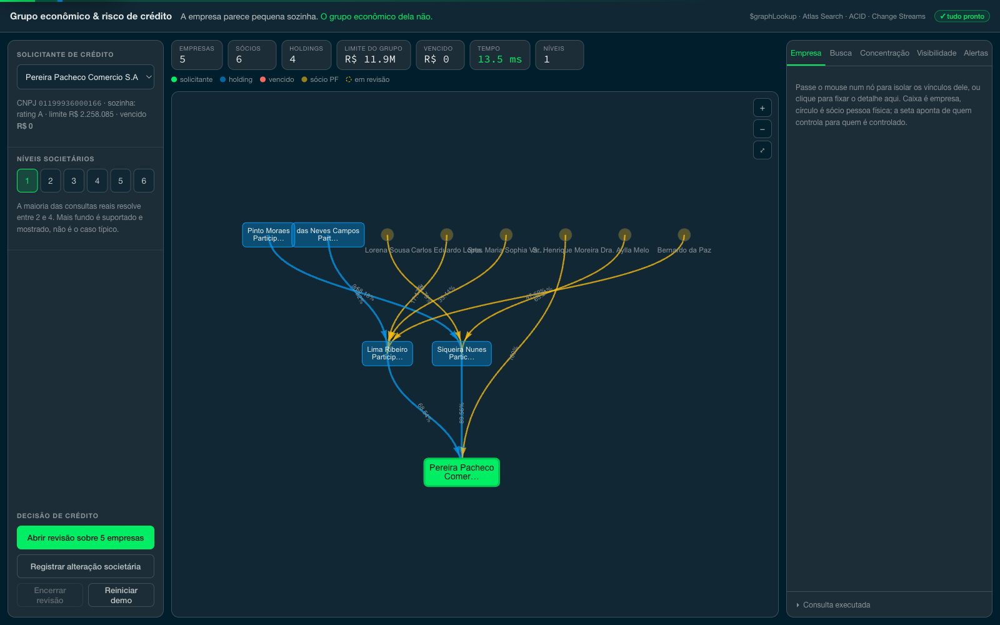
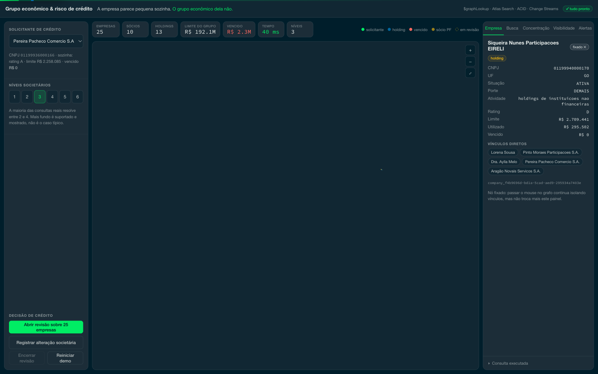
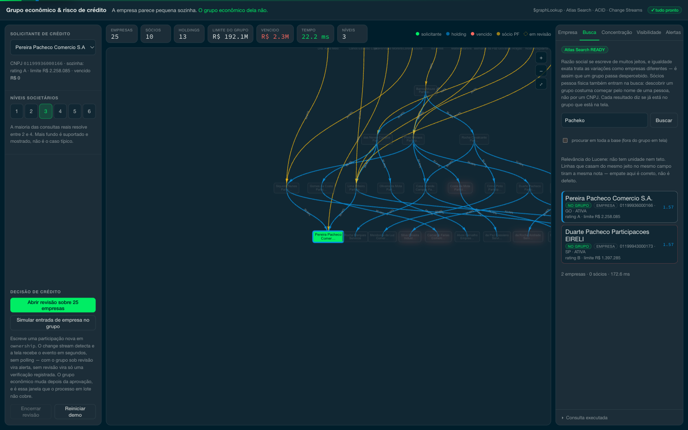
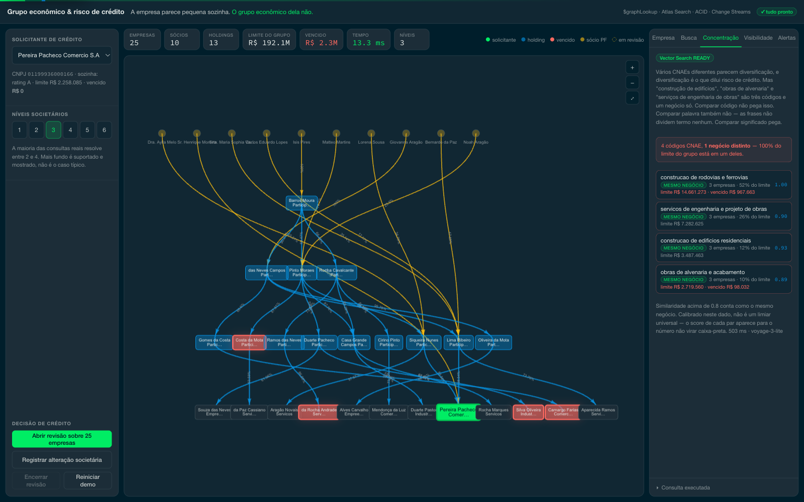
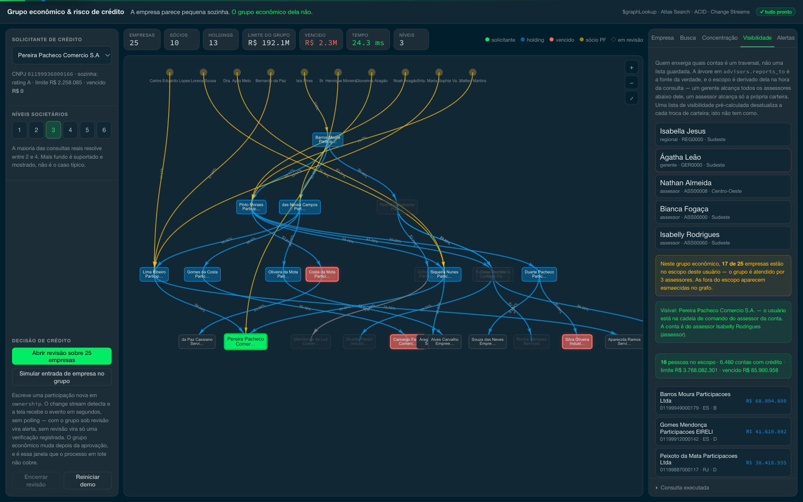
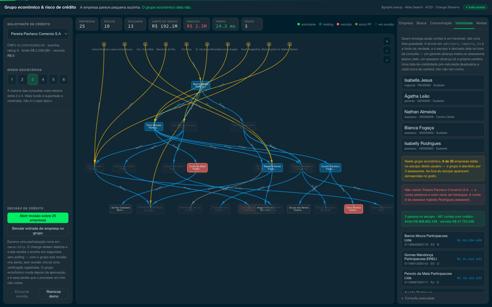

# Graph analytics on MongoDB Atlas — economic groups and visibility hierarchies

A company asks a bank for credit. Its own record looks clean: rating A, a limit
just above two million reais, nothing overdue. Approve?

On the demo dataset, the group behind that company holds **R$ 192 million** in
limits across 25 companies, and **R$ 2.3 million overdue** — none of it in the
applicant's record. It sits in sibling companies in another branch, and no analyst
assembles that view by hand under a decision SLA.

This project answers that question inside MongoDB, in one aggregation, in about
13 milliseconds over a base of 1.2 million companies and 2.5 million ownership
edges. Then it answers a second one with the same mechanism: **which accounts may
this user see?**

The data is synthetic, generated by this repository. No customer data was used.

The interface is in **Brazilian Portuguese** — it is presented to Brazilian banks,
and CNPJ, razão social, sócio and rating are the words those teams use. This
documentation is in English so the repository reads for a wider audience.

## Why this shape of graph, and not another

This is the honest filter, and it is the first thing to say to a customer who
asks why not Neo4j:

| Signal | Dedicated graph database | MongoDB |
|---|---|---|
| Query pattern | exploratory, dense, deep; graph algorithms in production | point lookup by business key over a shallow tree |
| Real bottleneck | traversal complexity | ingestion volume, licence and infrastructure cost, operations |
| Query frequency | high, ad-hoc, analytical | moderate, predictable, operational |
| Depth in practice | discovered by exploring | 2 to 4 hops answers most questions |

Both scenarios here live in the right-hand column. For the left-hand column the
honest answer is co-existence, and [COMPETITIVE.md](COMPETITIVE.md) says so before
it says anything else.

## Two graphs, modelled differently on purpose

| Graph | Relationship | Modelling |
|---|---|---|
| ownership chain | N:N, carries percentage and role | edge collection `ownership` |
| commercial hierarchy | functional — one person, one manager | self-referencing `advisors.reports_to` |

An edge collection for the hierarchy would only add a join. A `parent_id` field for
ownership could not hold a percentage or a second shareholder. The reasoning is in
[schema/collections.md](schema/collections.md), and it is worth ten minutes of any
architecture conversation.

## The demo

### 1. The company, alone

Search the CNPJ at depth 1. You see the applicant and who controls it directly:
five companies, R$ 11.9 million in limits, nothing overdue. This is what the credit
system shows today.



### 2. Raise the depth

At depth 2 the holding appears and the group opens to 25 companies across four
levels — including subsidiaries the applicant's record never mentions. The
consolidated exposure jumps to R$ 192 million, and R$ 2.3 million of arrears
appear in a branch the applicant is not part of.

One aggregation produced all of it: it walks up to the controllers, derives the
group roots inside the pipeline, walks down from every root, and hydrates
companies, shareholders and exposure — without going back to the application.



### 3. Fuzzy name resolution

A company or partner name typed with a different spelling still finds the record.
That is Atlas Search, in the same database — and it searches **inside the group on
screen** by default.

That default is deliberate. Searching the whole base returned twenty namesakes with
no relation to the graph the analyst is looking at, and no way to pair them with it.
The scope is applied in the index itself (`compound.filter` on `_id`), not by
filtering results afterwards. A checkbox opens the search to the whole base, and
that is the entity-resolution gesture: looking for a company that is *not* in the
graph yet and may belong to the group.

Clicking any result points at it on the graph — the node lights up, the rest dims,
and the canvas centres on it. Same for every other panel: an activity in
Concentration lights its companies, a user in Visibility lights their book, an alert
lights the two companies involved.



### 4. Concentration that CNAE codes hide

Four different activity codes look like diversification, and diversification is
what dilutes credit risk. "Building construction", "masonry works", "road and rail
construction" and "engineering services for construction" are four codes and **one
business** — 100% of the group's limit in a single block. Comparing codes misses
it. Comparing words misses it too, since the phrases share no term. Comparing
meaning catches it, with Atlas Vector Search.

The vectors live in their own collection, `activities` — one document per distinct
activity description, 32 of them. The first version embedded the field on all 1.2
million companies and searched that: 29 seconds per query, for a comparison
between 32 texts. Index the thing being compared, not every row that mentions it.



### 5. The bridge shareholder

One individual holds a minority stake in two conglomerates the registry treats as
unrelated. It is the finding that does not exist in any single record, and the one
that justifies the traversal.

### 6. Acting on the whole group

Opening the review flags every company in the group and writes the case in a single
multi-document ACID transaction: either the whole group goes under review or none
of it does. Try to open it twice and you get a 409 with the existing case id, not a
duplicate.

Register an ownership change afterwards and a change stream turns it into an alert
on screen. On a group not under review it produces a check, not an alert — and the
screen says so, because silence must not look like a broken demo.


### 7. Who may see which accounts

The second scenario, and the shortest to demonstrate. Pick a manager: the scope
panel shows the advisors below them and the consolidated book of all of them. Pick
an advisor: the scope collapses to one person and the book shrinks to their own
clients.

Nothing on the client asked for less data. The server derived the scope by walking
down `advisors.reports_to` from whoever the user is.

The boundary is drawn **on the graph itself**: every company carries the advisor who
covers it, and the ones outside the selected user's scope are dimmed in place — not
hidden, because they *are* part of the economic group; what changes is who may see
them. On the demo group, that produces the ladder the scenario exists to show:

| User | Sees, of the group's 25 companies |
|---|---|
| advisor | 9 |
| their manager | **17** |
| the regional above | **25** |

The showcase groups are deliberately split across three advisors — two under the
same manager, one under a different manager in the same region — so the visibility
boundary cuts through the middle of an economic group.

The common alternative is a materialised list of visible accounts per user. It goes
stale on every book transfer, and between the event and the recompute somebody sees
what they should not. A traversal cannot go stale.





## What it takes to run

- A MongoDB Atlas cluster, M10 or larger. Atlas Search and Vector Search do not
  exist in MongoDB Community, so running locally leaves those two panels disabled
  with a notice while everything else keeps working.
- Python 3.11 or newer, and Node 18 or newer.
- A Voyage API key for the embeddings. Without it, only the semantic panel is
  unavailable.

## Installation

```bash
cp .env.example .env      # fill in MONGODB_URI and VOYAGE_API_KEY

python3 -m venv .venv && .venv/bin/pip install -r data-generator/requirements.txt
python3 -m venv backend/venv && backend/venv/bin/pip install -r backend/requirements.txt
(cd frontend && npm install)
```

## Generating the data

```bash
bash data-generator/run_all.sh              # people, ownership, hierarchy, indexes
.venv/bin/python schema/search_indexes.py   # search indexes, waits until READY
.venv/bin/python data-generator/embed_activities.py
```

The defaults are 800,000 individuals, 1.2 million companies, 40,000 economic groups
and a 969-person commercial hierarchy. For a quick pass, use
`COMPANIES=200000 bash data-generator/run_all.sh`.

Running it again duplicates nothing: every document has an identifier derived from
its own content, so a second run rewrites the same records.

The population of individuals is a modelling decision, not a volume one. With
1.2 million companies and about 2.2 shareholders each, a population of 150,000 puts
the same person in ~17 companies — "shared shareholder" stops being an exception and
becomes a property of every pair of companies in the base.

## Running

```bash
./start.sh               # UI on 5350, API on 8350
POV_DEV=1 ./start.sh     # with hot reload, for development
```

## The numbers

They are in [queries/benchmarks.md](queries/benchmarks.md), all measured against
the cluster and reproducible with one command. None is an estimate.

| What | Command |
|---|---|
| Query latency, both scenarios | `PYTHONPATH=backend .venv/bin/python queries/bench.py --runs 30` |
| Load throughput | written to `queries/load-results.json` by every clean load |

The full base — 4.09 million documents — loads in **5 minutes 17 seconds**
(12,893 docs/s), measured from a workstation against a shared M20 over the public
internet. For this pattern that is the number that decides the architecture, not
the traversal time: the customer's bottleneck is getting the base in and operating
it.
| Suite that tries to break the app | `.venv/bin/python tests/test_resilience.py` |
| Mixed-workload stress, up to 64 concurrent | `.venv/bin/python tests/stress.py` |

Over a 9 ms network floor, the economic-group query costs about **4 ms** of actual
work at any depth up to the cap, and an advisor's book costs about 5 ms. A
manager's book — 16 advisors, 6,300 accounts with credit — costs 43 ms. A regional
level, 129 advisors and 51,000 accounts, takes about 460 milliseconds, and that is
the honest ceiling of this shape.

Two measured optimisations are documented there rather than quietly applied, because
each is a lesson:

- the economic-group query started as **up to ten serial calls** and 52 ms; as a
  single aggregation it is 13 ms. On a shallow tree, round trips cost more than
  traversal;
- the advisor book started by joining exposure per company and took **13 seconds**
  for a regional; denormalising `advisor_id` onto `credit_exposure` brought it to
  460 ms.

And one warning that is worth more than the numbers: mid-session the network path
to the cluster changed and the floor went from 8 ms to 307 ms. Every scenario "got
25× slower" with no code change. Always record the ping; compare increments, not
absolutes.

## Under load

`tests/stress.py` mixes the five paths of the demo and ramps to 64 concurrent
clients against the same shared M20. The first run exposed the real gap: no 5xx
and no wrong answers, but one heavy analytical query — a regional's book, 51,000
exposures summed — sat in the same queue as the point lookup the screen depends
on, and dragged its p95 to 2 seconds.

The answer was a **bulkhead**: four concurrent slots for the book, two for the
concentration analysis, and a `429` with `Retry-After` for whatever cannot get a
slot in 750 ms.

| At 64 concurrent | before | after |
|---|---|---|
| throughput | 34 req/s | **123 req/s** |
| p95, whole mix | 8,798 ms | **999 ms** |
| p95, ownership chain | 2,042 ms | **308 ms** |
| 5xx | 0 | 0 |
| consolidated figure drifted | no | no |

Refusing early is the feature, not a workaround. Queueing everything turns a load
spike into timeouts spread across paths that still had capacity — and the screen
says so, distinguishing "saturated, try again" from "this feature is down".

## If the demo breaks

It was built not to, and that is tested.

`tests/test_resilience.py` deliberately tries to bring the application down:
malformed input, absurd depth, Mongo operators smuggled in place of an identifier,
concurrent transactions fighting over the same documents, and a visibility check
that must actually refuse. The bar is always the same: it may refuse with a clear
message, it may not throw a generic error and it may not hang.

Before presenting, `GET /health` checks the connection, the counts, the state of the
search indexes and the time of a reference query. `POST /api/demo/reset` returns
everything to its initial state. The full script is in
[docs/demo-script.md](docs/demo-script.md).

## What this does not solve

[LIMITATIONS.md](LIMITATIONS.md) opens with the scope this project chose — a shallow
tree loaded in volume — and then lists the technical limits inside it: `$graphLookup`
needs an unsharded collection, there is no graph query language, there are no graph
algorithms on the server, and the traversal result has a 100 MB ceiling.

## Where everything is

| Folder | Contents |
|---|---|
| `data-generator/` | people, ownership base, commercial hierarchy, embeddings |
| `schema/` | indexes and collection modelling |
| `queries/` | the benchmark script and the measured results it wrote |
| `backend/` | the FastAPI API; every query lives in `app/db/` |
| `frontend/` | the React interface |
| `tests/` | the hostile suite and the mixed-workload stress |
| `docs/` | technical briefing, architecture decision records, demo script and business case |

To understand how it was built, start with
[implementation_plan.md](implementation_plan.md).
