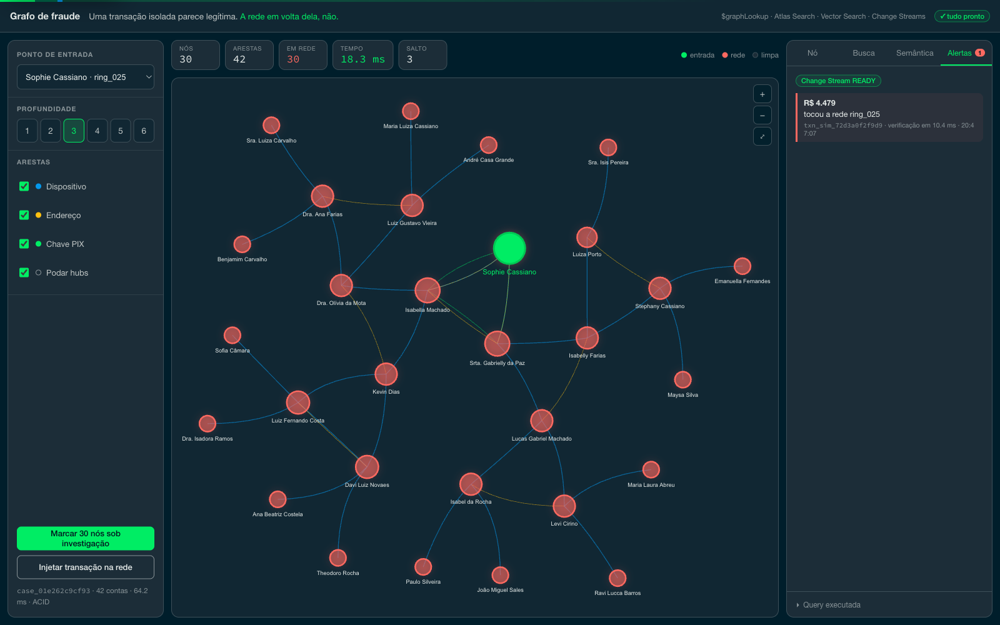

# Detecção de anel de fraude com grafos no MongoDB Atlas

Uma transação sozinha parece normal. Olhando a rede em volta dela — os
dispositivos, endereços e chaves PIX que ela divide com outras contas — aparece um
anel coordenado de mulas.

Este projeto mostra essa investigação inteira acontecendo dentro do MongoDB: o
traversal do grafo, a busca por nomes grafados errado, a busca por significado, a
marcação transacional da rede e o alerta da próxima transação suspeita. Sem banco
de grafo ao lado e sem pipeline de sincronização entre dois sistemas.

Os dados são sintéticos, gerados por este próprio repositório. Nenhum dado de
cliente foi usado.

## A ideia por trás

Na maioria das empresas, grafo não é um produto: é uma forma de investigar dados
que já estão num banco operacional. Quando é esse o caso, vale perguntar se
compensa manter um segundo banco só para isso, com o backup, o monitoramento, o
time e o pipeline de sincronização que vêm junto.

Esse é o argumento que o projeto testa. Ele não vale sempre, e as situações em que
não vale estão listadas em [LIMITATIONS.md](LIMITATIONS.md). Vale ler antes de
apresentar para alguém. A comparação com Neo4j e Neptune está em
[COMPETITIVE.md](COMPETITIVE.md).

## Como funciona na tela

Tudo cabe numa tela só: controles à esquerda, o grafo no meio, o painel de detalhe
à direita. As capturas abaixo foram feitas contra o cluster de verdade, com o
cenário rodando.

### 1. Uma conta que não diz nada sozinha

O ponto de partida, olhando só um salto de distância. Sete vínculos, nada que
justifique abrir uma investigação.


### 2. A rede aparece

Aumentando para dois e depois três saltos: sete nós viram quinze, e depois trinta.
Os vermelhos são o anel. É uma consulta só, e o tempo dela está no alto da tela.


### 3. Seguir um vínculo específico

Passar o mouse sobre um nó acende os vizinhos dele e apaga o resto, para a cadeia
que interessa ficar sozinha na tela. O painel da direita mostra a que distância o
nó está, quantos vínculos tem e quais são, clicáveis. Arrastar um nó faz os
vizinhos abrirem espaço em vez de ficarem um em cima do outro.


### 4. O nome que está quase certo

Alguém foi cadastrado como "Maria Clara Ram0s". O traversal, que compara valores
exatos, nunca ligaria essa pessoa à "Maria Clara Ramos" que está no anel. O Atlas
Search liga, e roda no mesmo cluster.


### 5. Motivos escritos de outro jeito

A consulta é "paguei o valor mensal da casa em que moro de aluguel", uma frase que
não existe na base. Os três primeiros resultados falam de aluguel sem repetir
nenhuma palavra da pergunta.


### 6. Agir sobre a rede toda, e ver a próxima chegar

Marcar o anel atualiza contas, pessoas e o registro de auditoria numa transação
só: ou tudo entra em investigação, ou nada entra. Logo depois, uma transação nova
toca a rede marcada e o alerta aparece na tela sozinho.



## O que é preciso para rodar

- Um cluster MongoDB Atlas M10 ou maior. O Atlas Search e o Vector Search não
  existem no MongoDB community, então rodando local esses dois painéis ficam
  desativados com um aviso e o resto continua funcionando.
- Python 3.11 ou mais novo, e Node 18 ou mais novo.
- Uma chave da Voyage para gerar os embeddings. Sem ela, só o painel de busca por
  significado fica indisponível.

## Instalação

```bash
cp .env.example .env      # preencher MONGODB_URI e VOYAGE_API_KEY

python3 -m venv .venv && .venv/bin/pip install -r data-generator/requirements.txt
python3 -m venv backend/venv && backend/venv/bin/pip install -r backend/requirements.txt
(cd frontend && npm install)
```

## Gerar os dados

```bash
bash data-generator/run_all.sh            # população, índices, anéis e arestas
.venv/bin/python schema/search_indexes.py # índices de busca, espera ficarem prontos
.venv/bin/python data-generator/embed_reasons.py
```

O padrão são 150 mil pessoas, 240 mil contas, 600 mil transações e 40 anéis
injetados. Para uma volta rápida, use `PEOPLE=20000 TXNS=80000 bash
data-generator/run_all.sh`.

Rodar de novo não duplica nada: cada documento tem um identificador derivado do
próprio conteúdo, então a segunda execução reescreve os mesmos registros.

## Rodar

```bash
./start.sh               # interface em 5350, API em 8350
DEV=1 ./start.sh     # com recarga automática, para desenvolver
```

## Os números

Estão em [queries/benchmarks.md](queries/benchmarks.md), todos medidos contra o
cluster e reproduzíveis com um comando. Nenhum é estimativa.

| O que | Comando |
|---|---|
| Tempo do traversal por profundidade | `.venv/bin/python queries/bench.py --runs 30` |
| Plano de execução da consulta | `mongosh "$MONGODB_URI" queries/08_explain_traversal.js` |
| Comportamento com 2,4 milhões de arestas | `.venv/bin/python tests/scale_graph.py --build --measure` |
| Ganho do índice composto | `.venv/bin/python tests/index_tuning.py` |
| Suíte que tenta quebrar a aplicação | `.venv/bin/python tests/test_resilience.py` |

Contra um cluster na mesma região, o traversal do anel leva menos de 10
milissegundos. Num grafo de 2,4 milhões de arestas, dois saltos alcançam 21 mil
nós em 254 milissegundos, e três saltos não terminam sem poda: estouram o limite
de 100 MB que o `$graphLookup` tem para montar o resultado. Isso está explicado
em [LIMITATIONS.md](LIMITATIONS.md).

Quando um número mudou muito, o arquivo conta o motivo em vez de trocar o valor em
silêncio. Foi o caso do traversal, que caiu de 525 para 275 milissegundos quando
descobrimos que um índice estava sumindo, e depois para 9, quando as medições
passaram a ser feitas sem um proxy no caminho.

## Se a demo quebrar

Ela foi feita para não quebrar, e isso é testado.

`tests/test_resilience.py` tem 58 casos que tentam derrubar a aplicação de
propósito: entradas malformadas, profundidade absurda, operadores do Mongo
enfiados no lugar de um identificador, oito transações concorrentes disputando os
mesmos documentos, uma rajada de transações no listener de eventos, e quarenta
consultas simultâneas. O critério é sempre o mesmo: pode recusar com uma mensagem
clara, não pode dar erro genérico nem travar.

Antes de apresentar, `GET /health` confere a conexão, as contagens, o estado dos
índices de busca e o tempo de uma consulta de referência. `POST /api/demo/reset`
devolve tudo ao estado inicial. O roteiro completo está em
[docs/demo-script.md](docs/demo-script.md).

## O grafo se atualiza sozinho

Montar as arestas em lote leva uns quinze minutos, o que levanta a pergunta óbvia:
e a transação que chega depois disso?

O mesmo fluxo de eventos que dispara o alerta também cria a aresta. Duas pessoas
sem nenhuma ligação passam a usar o mesmo dispositivo e o vínculo aparece no grafo
em cerca de dois segundos, já visível para a consulta seguinte. Dá para ver
acontecendo com `POST /api/demo/link-accounts`.

O que esse caminho ainda não faz, e o que continua dependendo do processamento em
lote, está em
[docs/adr/0003-manutencao-incremental-de-arestas.md](docs/adr/0003-manutencao-incremental-de-arestas.md).

## Onde está cada coisa

| Pasta | Conteúdo |
|---|---|
| `data-generator/` | geração dos dados, injeção dos anéis, montagem das arestas, embeddings |
| `schema/` | índices e modelagem das coleções |
| `queries/` | as consultas em `mongosh`, o benchmark e a prova de plano |
| `backend/` | a API em FastAPI; toda consulta fica em `app/db/` |
| `frontend/` | a interface em React |
| `tests/` | resiliência, escala e ajuste de índice |
| `docs/` | briefing técnico, decisões de arquitetura e roteiro da demo |

Para entender como foi construído, comece por
[implementation_plan.md](implementation_plan.md).
