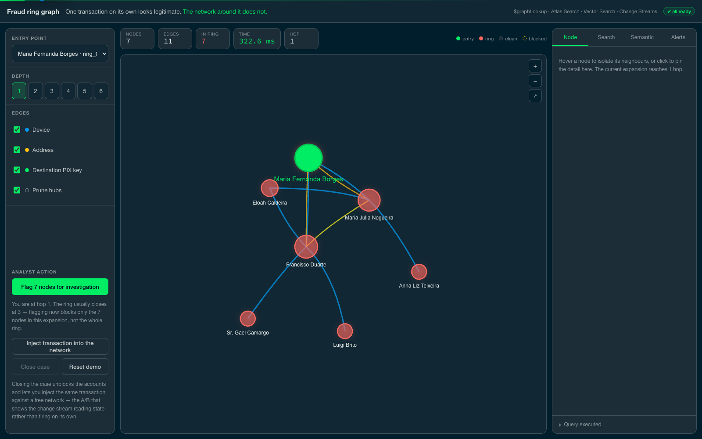
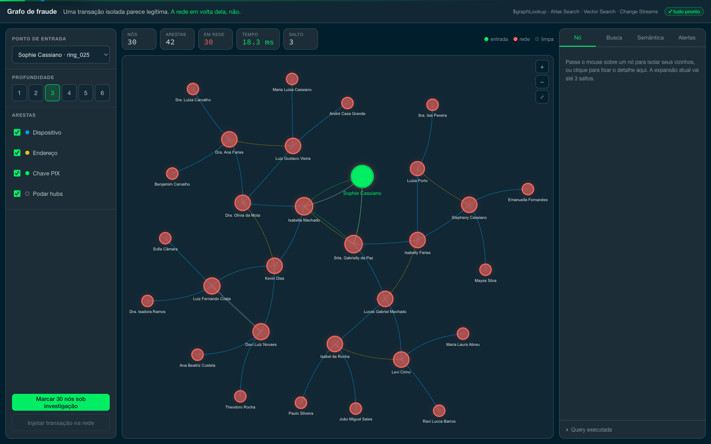
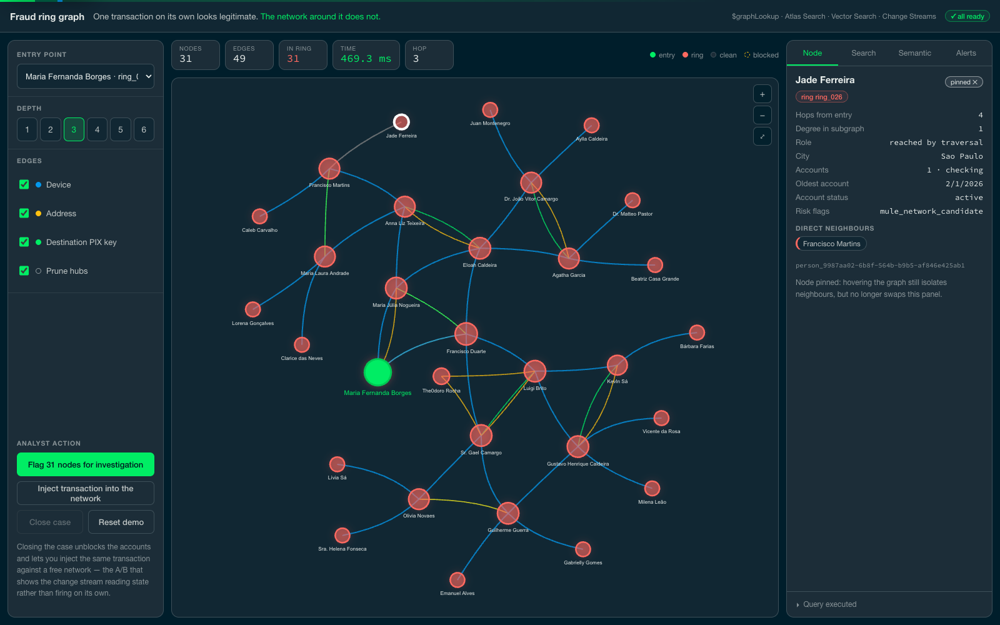
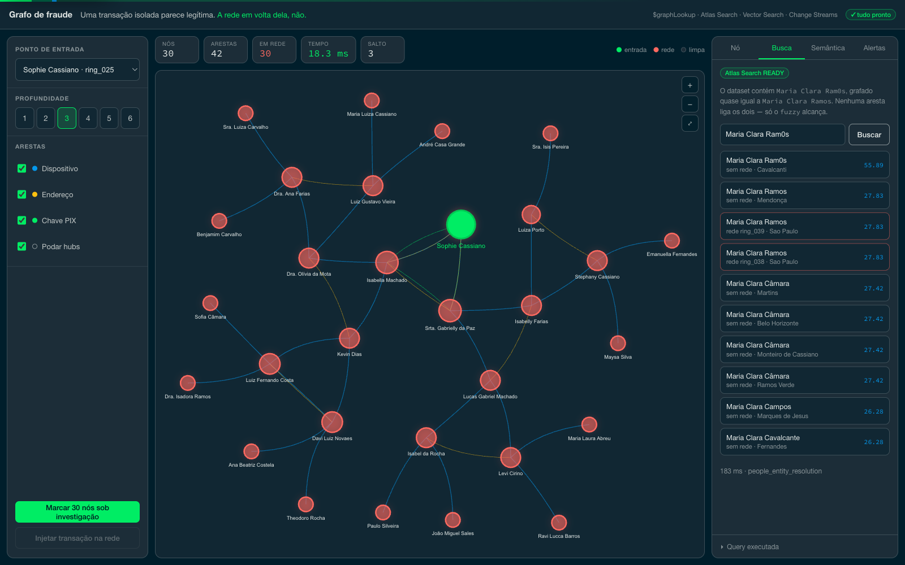
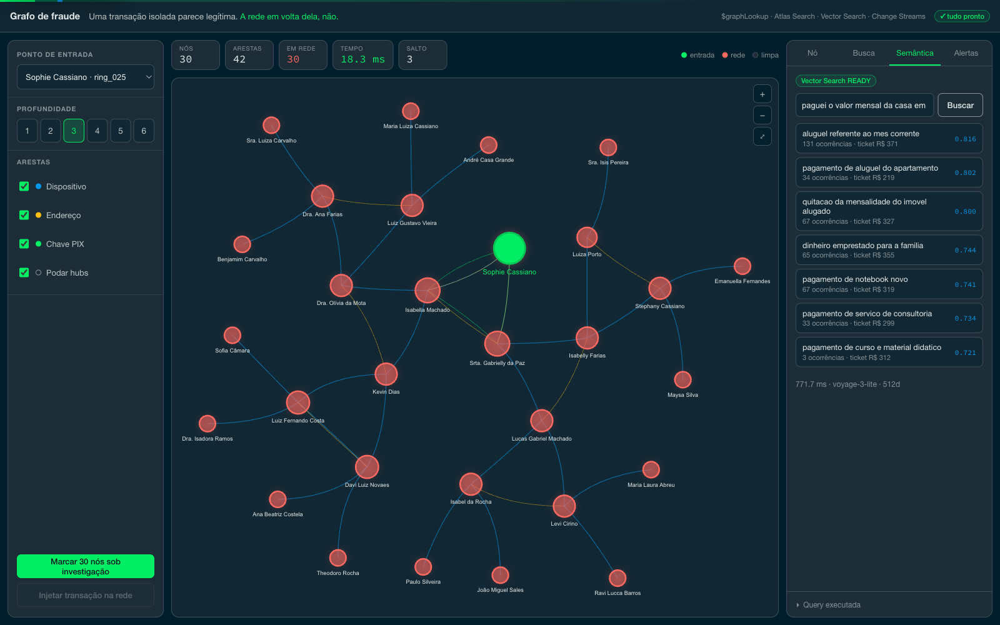
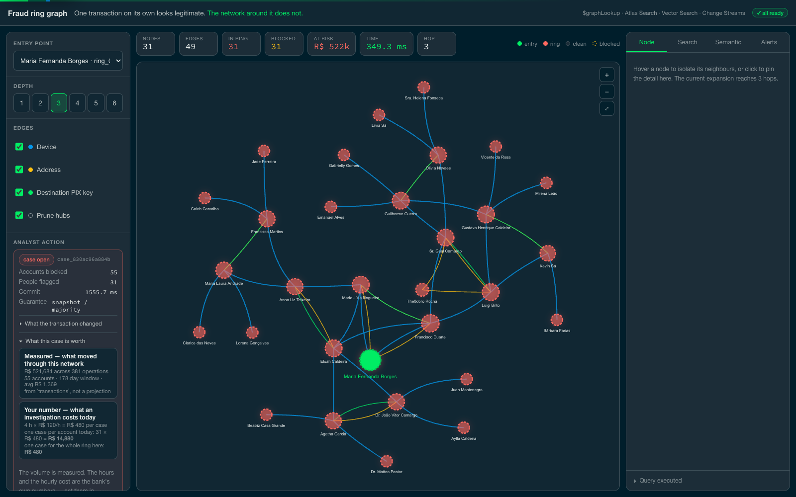
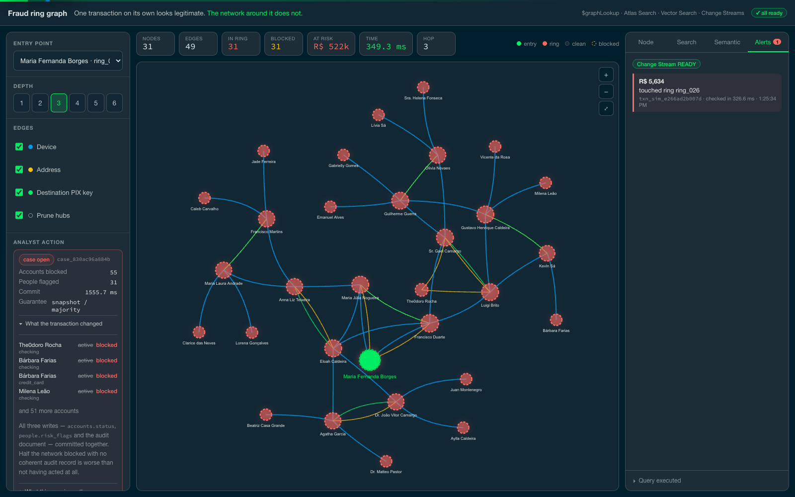

# Fraud ring detection with graphs on MongoDB Atlas

One transaction on its own looks normal. Look at the network around it — the
devices, addresses and destination PIX keys it shares with other accounts — and a
coordinated ring of money mules appears.

This project shows that whole investigation happening inside MongoDB: the graph
traversal, the search for misspelled names, the search by meaning, the
transactional flagging of the network and the alert on the next suspicious
transaction. No graph database alongside it, and no synchronisation pipeline
between two systems.

The data is synthetic, generated by this repository. No customer data was used.

## The three links

The graph is built on what accounts share when they should not:

| Link | What it means | Why it is evidence |
|---|---|---|
| **device** | accounts operated from the same device fingerprint | four different national IDs on one device is not a family, it is one operator running several accounts |
| **address** | the same address on separate customer records | weak on its own (shared housing is common); strong when several accounts were opened there in a short window |
| **destination PIX key** | separate accounts paying repeatedly into the **same key** | this is the collection account at the end of the funnel — the classic mule-network signature |

The third one deserves a note, because the obvious modelling is wrong: **two
accounts cannot hold the same PIX key.** Brazil's DICT directory (BCB Resolution
No. 1/2020) guarantees that one key addresses exactly one transactional account at
a time, and rejects duplicate registration. So the key lives on `accounts` with a
unique index, and the link is the other side of the payment: the shared
destination.

## The idea behind it

In most companies a graph is not a product: it is a way of investigating data that
already lives in an operational database. When that is the case, it is worth
asking whether a second database is worth keeping just for that, along with the
backups, monitoring, staff and synchronisation pipeline that come with it.

That is the argument this project tests. It does not always hold, and the
situations where it does not are listed in [LIMITATIONS.md](LIMITATIONS.md). Worth
reading before presenting it to anyone. The comparison with Neo4j and Neptune is
in [COMPETITIVE.md](COMPETITIVE.md).

## How it works on screen

Everything fits on one screen: controls on the left, the graph in the middle, the
detail panel on the right. The screenshots below were taken against the real
cluster with the scenario running.

### 1. An account that says nothing on its own

The starting point, looking only one hop out. Seven links, nothing that justifies
opening an investigation.



### 2. The network appears

Going to two and then three hops: seven nodes become sixteen, then the whole ring.
The red ones are the ring. It is a single query, and its execution time is at the
top of the screen.



### 3. Following one specific link

Hovering a node lights up its neighbours and dims the rest, so the chain that
matters is alone on screen. Clicking **pins** the node: the panel stops following
the mouse and shows how far the node is, how many accounts it holds and when they
were opened. Dragging a node makes its neighbours make room instead of piling up.



### 4. The name that is almost right

Someone was registered as "Maria Clara Ram0s". The traversal, which compares exact
values, would never link that person to the "Maria Clara Ramos" in the ring. Atlas
Search does, and it runs on the same cluster.

Search results also say whether each hit is **in the network on screen** or
outside it — searching a common first name returns the one that matters at the
top, not ten strangers.



### 5. Reasons written a different way

Scoped to the ring on screen, semantic search answers a question an analyst
actually asks: *what reasons do these accounts give for moving money?* The answer
is not one phrase — it is the pattern. Eight different ways of saying the same
thing, across accounts that supposedly do not know each other.



### 6. What the network is worth

The **At risk** tile is the volume those accounts actually moved, summed from
`transactions` on the live cluster. It is the number that turns "thirty nodes" into
"why should I care?", and it is measured, not projected.

Opening **What this case is worth** splits it into what we measured (volume,
operations, accounts, window) and what the bank supplies (hours and cost per case,
set in `.env`). We deliberately do not estimate loss avoided: converting exposure
into realised loss needs a rate that varies by product and institution, and
guessing it would undo the credibility of every measured number here. The framing
is in [docs/business-case.md](docs/business-case.md).



### 7. Acting on the whole network, and watching the next one arrive

Flagging the ring updates accounts, people and the audit record in a single
transaction: either the whole network goes under investigation or none of it does.
Flagged nodes get a dashed border on the graph, so the action is visible where the
investigation happens.

Right after, a new transaction touches the flagged network and the alert appears
on its own. Close the case and inject the same transaction again: **no alert** —
and the screen says so, because silence must not look like a broken demo.



## What it takes to run

- A MongoDB Atlas cluster, M10 or larger. Atlas Search and Vector Search do not
  exist in MongoDB Community, so running locally leaves those two panels disabled
  with a notice while everything else keeps working.
- Python 3.11 or newer, and Node 18 or newer.
- A Voyage API key to generate the embeddings. Without it, only the semantic
  search panel is unavailable.

## Installation

```bash
cp .env.example .env      # fill in MONGODB_URI and VOYAGE_API_KEY

python3 -m venv .venv && .venv/bin/pip install -r data-generator/requirements.txt
python3 -m venv backend/venv && backend/venv/bin/pip install -r backend/requirements.txt
(cd frontend && npm install)
```

## Generating the data

```bash
bash data-generator/run_all.sh            # population, indexes, rings and edges
.venv/bin/python schema/search_indexes.py # search indexes, waits until READY
.venv/bin/python data-generator/embed_reasons.py
```

The defaults are 150,000 people, 240,000 accounts, 600,000 transactions and 40
injected rings. For a quick pass, use `PEOPLE=20000 TXNS=80000 bash
data-generator/run_all.sh`.

Running it again duplicates nothing: every document has an identifier derived from
its own content, so a second run rewrites the same records.

Order matters in one place: `embed_reasons.py` must run **after** the rings are
injected. Run it earlier and the ring transactions end up without vectors, and the
semantic panel scoped to a network comes back almost empty.

## Running

```bash
./start.sh               # UI on 5350, API on 8350
POV_DEV=1 ./start.sh     # with hot reload, for development
```

## The numbers

They are in [queries/benchmarks.md](queries/benchmarks.md), all measured against
the cluster and reproducible with one command. None is an estimate.

| What | Command |
|---|---|
| Traversal time by depth | `.venv/bin/python queries/bench.py --runs 30` |
| Query execution plan | `mongosh "$MONGODB_URI" queries/08_explain_traversal.js` |
| Behaviour with 2.4 million edges | `.venv/bin/python tests/scale_graph.py --build --measure` |
| Gain from the compound index | `.venv/bin/python tests/index_tuning.py` |
| Suite that tries to break the app | `.venv/bin/python tests/test_resilience.py` |

Against a cluster in the same region, the ring traversal takes under 10
milliseconds. On a graph of 2.4 million edges, two hops reach 21,000 nodes in 254
milliseconds, and three hops do not finish without pruning: they blow past the
100 MB limit `$graphLookup` has for assembling its result. That is explained in
[LIMITATIONS.md](LIMITATIONS.md).

When a number changed a lot, the file explains why instead of quietly swapping the
value. That was the case for the traversal, which dropped from 525 to 275
milliseconds when we found an index going missing, and then to 9 once the
measurements stopped going through a proxy.

## If the demo breaks

It was built not to, and that is tested.

`tests/test_resilience.py` has 58 cases that deliberately try to bring the
application down: malformed input, absurd depth, Mongo operators smuggled in place
of an identifier, eight concurrent transactions fighting over the same documents, a
burst of transactions at the event listener, and forty simultaneous queries. The
bar is always the same: it may refuse with a clear message, it may not throw a
generic error and it may not hang.

Before presenting, `GET /health` checks the connection, the counts, the state of
the search indexes and the time of a reference query. `POST /api/demo/reset`
returns everything to its initial state. The full script is in
[docs/demo-script.md](docs/demo-script.md).

## The graph maintains itself

Building the edges in batch takes about fifteen minutes, which raises the obvious
question: what about the transaction that arrives after that?

The same event stream that fires the alert also creates the edge. Two people with
no connection at all start using the same device and the link shows up in the
graph in about two seconds, already visible to the next query. You can watch it
happen with `POST /api/demo/link-accounts`.

What that path still does not do, and what remains the job of batch processing, is
in
[docs/adr/0003-manutencao-incremental-de-arestas.md](docs/adr/0003-manutencao-incremental-de-arestas.md).

## Where everything is

| Folder | Contents |
|---|---|
| `data-generator/` | data generation, ring injection, edge materialisation, embeddings |
| `schema/` | indexes and collection modelling |
| `queries/` | the `mongosh` queries, the benchmark and the execution-plan proof |
| `backend/` | the FastAPI API; every query lives in `app/db/` |
| `frontend/` | the React interface |
| `tests/` | resilience, scale and index tuning |
| `docs/` | technical briefing, architecture decision records, demo script and business case |

To understand how it was built, start with
[implementation_plan.md](implementation_plan.md).
